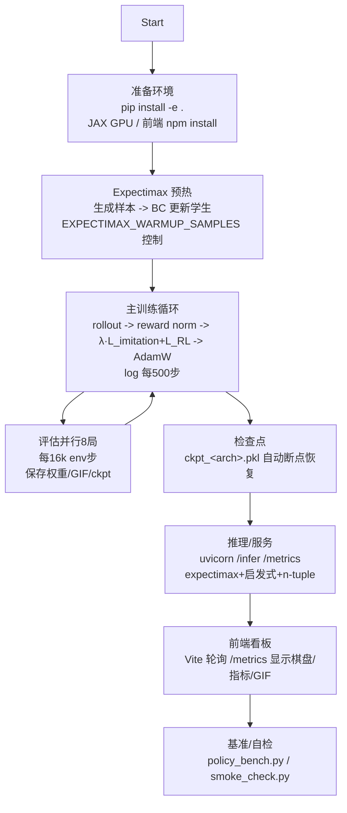

# 2048 (DiscoRL) 项目使用手册

## 概览

本项目基于 Google DeepMind 的 DiscoRL 框架，使用冻结教师规则（Disco103）+ 学生网络（CNN 或 AxialTransformer）来玩 2048。支持 expectimax 预热、自动断点续训、实时指标与前端可视化。

---

## 快速开始（环境）

- Python 3.11+；建议虚拟环境：`python -m venv .venv && source .venv/bin/activate` 或 conda。
- 安装依赖：`pip install -e .`，以及 `pip install tensorboardX imageio fastapi uvicorn`（服务/GIF）。
- GPU 版 JAX：按 CUDA 版本安装 `jax[cudaXX_pip]`。
- 前端：`cd frontend && npm install`。

---

## 训练入口（默认自动断点 + 预热）

- Transformer：`python train_2048.py`
- CNN：`MODEL_KIND=cnn python train_2048.py`
- 冒烟：`SANDBOX_RUN=1 TQDM_OFF=1 python train_2048.py`
- 强制重头：`RESUME=0 python train_2048.py`（默认 `RESUME=1` 自动加载 `checkpoints/ckpt_<arch>.pkl`）
- 预热：默认用 expectimax 生成 1024 样本做 BC 预热；关闭：`EXPECTIMAX_WARMUP_SAMPLES=0`。

输出：权重 `hybrid_adaptive_2048_v5.1_<arch>.npz/_best.npz`，日志 `logs/*.csv`，GIF `artifacts/*.gif`，断点 `checkpoints/ckpt_<arch>.pkl`。

---

## 推理与指标服务

```
uvicorn serve_infer:app --port 8000 --reload
```

- `/infer`：expectimax(3–4 ply 自适应) + 启发式 + n‑tuple 叶子估值，返回 best_move/logits/valid/value/深度/节点数/耗时。
- `/metrics`：返回最新 train/eval CSV 行与 GIF 路径（前端轮询）。

前端看板：`cd frontend && VITE_API_PROXY=http://localhost:8000 npm run dev`，展示棋盘、动作概率、训练指标、最新评估 GIF。

---

## 训练流程——多角度理解

### 时间线视角

1) **Expectimax 预热**（可关）：生成高质量样本，BC 更新学生。
2) **主训练循环**：rollout → 奖励归一化 → imitation+RL 混合损失 → AdamW 更新；每 500 步写日志。
3) **评估**：每 16k 环境步并行 8 局，保存权重/GIF/ckpt。
4) **断点**：每次评估、结束时写 ckpt；启动默认自动恢复。

### 数据流视角

环境(obs, action_mask) → rollout(scan) → reward norm(EMA) → 网络前向 → loss = λ·L_imitation + L_RL → grad clip + AdamW → 更新 params/opt_state → 部分 reset → 日志/评估/GIF。

### 组件视角

- 环境：`jittable_2048`（one-hot 观测，动作掩码，auto_reset=False）。
- 网络：CNN 或 AxialTransformer（`MODEL_KIND` 切换）。
- 教师：Disco103 冻结；学生学习模仿 + RL。
- 预热：expectimax 行为克隆。
- 服务/前端：`serve_infer.py` + Vite React 看板。

---

## 数学推理要点（为什么可行）

- 目标函数：对策略 π_θ，损失 `L(θ) = E[ λ_t · L_imitation(π_θ, π_teacher) + L_RL(π_θ) ]`，其中 λ_t∈[0,1] 随时间减小。凸组合保证梯度仍是下降方向，cosine 退火避免突变。
- 奖励有界（2048 每步有限分），动作掩码强制有效动作；reward norm (EMA) + grad clip + `nan_to_num` 控制梯度范数，提升优化稳定性。
- 预热（expectimax BC）：先用高质量专家分布 q 生成样本做交叉熵最小化，使 KL(π_θ ‖ q) 降低，减少 compounding error；BC 误差 ε 会线性影响后续期望损失上界 O(ε·T)（DAgger 理论）。
- RL 分支：`L_RL` 近似 Bellman 目标（值/优势或 Q），在 λ_t 减小时开始主导，纠偏专家的局部次优。
- 估值与搜索：推理端 expectimax 3–4 ply ≈ 一步 lookahead 的 Bellman backup；叶子估值启发式+n‑tuple 给出稳定下界，降低方差。
- 收敛直觉：初期高 λ_t 保证快速模仿强教师（减少状态分布漂移）；中后期 RL 校正 + reward norm/clip 抑制梯度爆炸；有限状态/动作下，参数化网络在 Lipschitz 约束下可达到近似最优策略。
- 简单误差界（直观版）：设 BC 误差 ε，rollout 长度 T，使用掩码避免非法动作，reward 有界 R_max，则策略偏差导致的回报差 ≈ O(ε·T·R_max)；混合训练在初期将 ε 压低，中期 λ_t↓ 时 RL 进一步减少分布偏移。

## 训练/推理流程图



---

## 进阶：教师（超网络）可训练方案（可选）

- 新增开关：`train_teacher=True`，`teacher_lr=1e-4`，`teacher_update_every=5`，`teacher_kl_reg=1e-3`，`teacher_grad_clip=1.0`。
- 思路：教师低频、小步率更新，独立优化器；在更新步加入 KL(student‖teacher) 正则，防漂移；ckpt 保存教师参数/opt_state。

---

## 进一步优化建议

- 推理：叶子估值可加模型 value 融合权重；必要时查表微优化（特定局面直接用 lookup）。
- 吞吐：单 GPU 用大 batch/rollout；评估并行多局；减少日志同步。
- 稳定性：保持动作掩码、auto_reset=False 与教师一致；ε 固定 0.05–0.1 防早收敛；梯度/损失钳制已启用。

---

## 目录速览

- `train_2048.py`：训练/评估，自动断点，expectimax 预热，日志/GIF/ckpt。
- `serve_infer.py`：推理+指标，expectimax + 启发式 + n‑tuple 叶子估值。
- `disco_rl/`：环境、网络、更新规则。
- `artifacts/`：评估 GIF。
- `logs/`：训练/评估 CSV。
- `checkpoints/`：断点文件。
- `frontend/`：实时看板。
- `policy_bench.py`：零预测基准。
- `smoke_check.py`：冒烟测试。
- `run_all.sh`：一键依赖+训练（类 Unix）。
